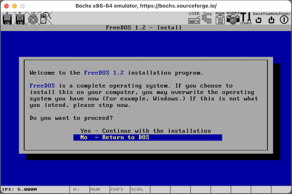
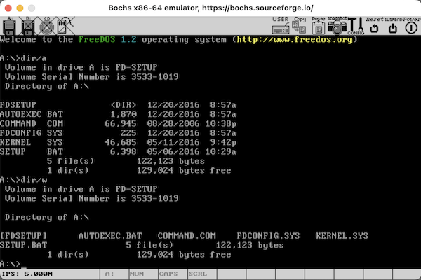
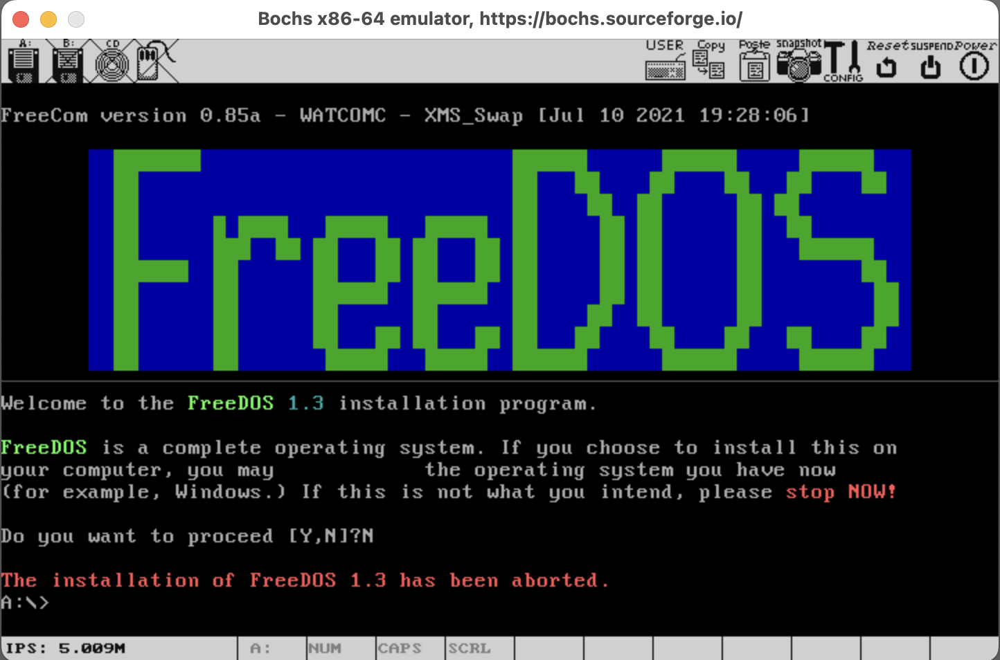

# README

This is a Bochs workspace to play with some old vresion Linux kernel and also use to learn Assembly language.

## Screen Shots

- 
- 
- 

## Overview

- demo-mbr : A MBR demo to show "Hello 2025!"
- demo-freedos : FreeDos 1.2 & 1.3 demo with bochs

## Bochs Environment

Only note the Bochs environment on macOS, please adjust as nessary if you are using Linux or MS Windows.

```shell
echo "Install needed packages:"
brew install nasm
brew install bochs
```

## Quick Start

```shell
echo "Demo with MBR example:"
cd demo-mbr; make burnfd; make run-fd
```
